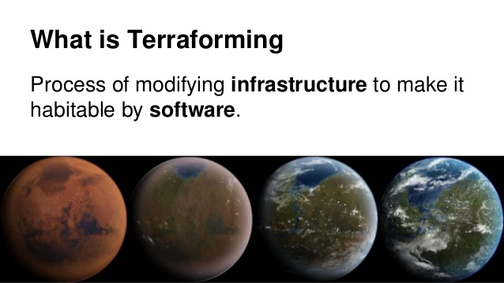

# 2. Terraform Overview
https://www.terraform.io/guides/core-workflow.html

# Terraformとは何ぞや？！

__Terra__ ⇨ラテン語でearth, 地盤のような意味

__Form__ ⇨作る

__Terra__ + __form__ ＝＞ __インフラ(地盤)__ を構築する的な意味(（especially in science fiction) transform (a planet) so as to resemble the earth, especially so that it can support human life.)

# 従来のインフラ構築とTerraformの違い
__従来__：AWSのコンソールでマニュアルでぽちぽち

__未来__：Terraformのコードでインフラを設定・ディプロイ→インフラをソフトウェアのように扱える！

# Terraform（IaC）のメリット
- マニュアルエラーが減る
- インフラをソフトウェアのようにコード化できる、GitなどにコミットしてHistoryを見れる
- スケーラブル。複数（何十個以上）のインフラを複製するのに、マニュアル作業より正確で速くできる
- 変更するときに、Dry-runで何が変わるのか（作成・変更・削除）表示してくれる（エラーを防ぐ）
- クラウドvendor agnostic

DevOpsの流れである __IaC（Infra as Code)__ に乗っ取ったテクノロジー。AWS専門のIoCである __Cloud Formationテンプレート__ がありあますが、TerraformならVendor-lockinがされず、AWS、Azure、GCPなどいろんなクラウドProviderに対応できます。

# Terraformのコードを書く流れ
1. まずはInfraの知識が必要。例えばAWSのEC2の設定やParameterなど。

2. TerraformのSyntaxなどの知識を習得し、コーディング。

3. `terraform init`

4. `terraform plan`

5. `terraform apply`

`terraform apply --auto-approve`でManual Approveをスキップできますが、危険なので、`terraform plan`でどのリソースが変わるのかをよく確認した後に、`terraform apply`で実行するのがベストプラクティスです。

