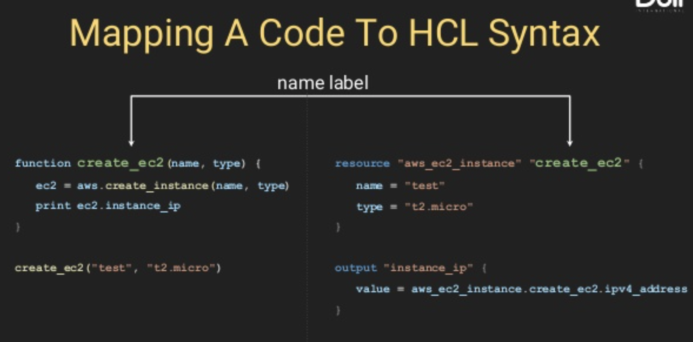
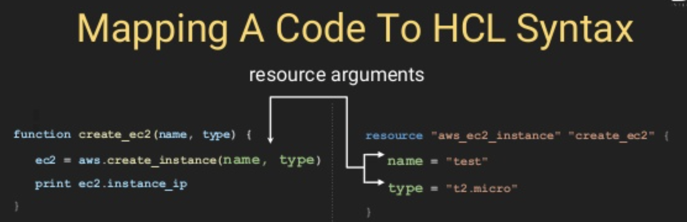

# 3. Terraform Syntax ベーシック

# 3.1 resourceを使ってインフラを定義する

Refs:
  - https://learn.hashicorp.com/tutorials/terraform/resource?in=terraform/configuration-language
  - https://www.terraform.io/docs/configuration/syntax.html#blocks
  - https://www.terraform.io/docs/configuration/blocks/resources/syntax.html#resource-syntax
  - https://www.slideshare.net/VadimSolovey/terraform-modules-restructured-220136382


Function/Method name:


Function/Method arguments:


Resource は各provider(AWS, GCP)によって提供され、EC2, ELB, S3などのオブジェクトを作成できます

[3.1_resource_block/main.tf](3.1_resource_block/main.tf)
```sh
# "aws_instance"というタイプのresourceを定義し、 そのリソースに"web"というローカルネームをつける
resource "aws_instance" "web" {  # <----- function create_ec2(name, type)のTerraformのSyntax

  # aws_instance resourceのArguments
  ami           = "ami-0992fc94ca0f1415a"
  instance_type = "t2.micro"
}

# local nameはユニークでなければいけない（"web"は再定義不可）
resource "aws_instance" "app" { # <----- 同じfunction aws_instance()のAlias/local nameの"web"は上に定義されているので、使用不可。違う名前の"app"にする　
  ami           = "ami-0992fc94ca0f1415a"
  instance_type = "t2.micro"
}


## 最低限必要なAWS Config (AWS CLIで”aws config”を実行して、Region、Access Keyなどを設定するのと同じ) ##
variable "aws_region" {
  default = "ap-northeast-1"
}
variable "aws_profile" {
  # type = string
  default = "aws-demo"
  # description = "AWS CLI's profile"
}
provider "aws" {
    #　Access keyを使っても酔いが、AWSのProfileの方が便利且つ、Secret Access Keyを間違ってGitにコミットしてしまう恐れがなく安全。
    # access_key = var.aws_access_key
    # secret_key = var.aws_secret_key
    
    region = var.aws_region
    profile = var.aws_profile
    version = "~> 2.49"
}
```

`terraform plan`を実行してEC2を作成してみると、作成されるリソースの詳細が表示されるのがわかる
```sh
$ terraform init
$ terraform plan

Terraform will perform the following actions:

  # aws_instance.app will be created
  + resource "aws_instance" "app" {
      + ami                          = "ami-0992fc94ca0f1415a"
      + arn                          = (known after apply)
      + associate_public_ip_address  = (known after apply)
      + availability_zone            = (known after apply)
      + cpu_core_count               = (known after apply)
      + cpu_threads_per_core         = (known after apply)
      + get_password_data            = false
      + host_id                      = (known after apply)
      + id                           = (known after apply)
      + instance_state               = (known after apply)
      + instance_type                = "t2.micro"
      + ipv6_address_count           = (known after apply)
      + ipv6_addresses               = (known after apply)
      + key_name                     = (known after apply)
      + network_interface_id         = (known after apply)
      + outpost_arn                  = (known after apply)
      + password_data                = (known after apply)
      + placement_group              = (known after apply)
      + primary_network_interface_id = (known after apply)
      + private_dns                  = (known after apply)
      + private_ip                   = (known after apply)
      + public_dns                   = (known after apply)
      + public_ip                    = (known after apply)
      + security_groups              = (known after apply)
      + source_dest_check            = true
      + subnet_id                    = (known after apply)
      + tenancy                      = (known after apply)
      + volume_tags                  = (known after apply)
      + vpc_security_group_ids       = (known after apply)

      + ebs_block_device {
          + delete_on_termination = (known after apply)
          + device_name           = (known after apply)
          + encrypted             = (known after apply)
          + iops                  = (known after apply)
          + kms_key_id            = (known after apply)
          + snapshot_id           = (known after apply)
          + volume_id             = (known after apply)
          + volume_size           = (known after apply)
          + volume_type           = (known after apply)
        }

      + ephemeral_block_device {
          + device_name  = (known after apply)
          + no_device    = (known after apply)
          + virtual_name = (known after apply)
        }

      + metadata_options {
          + http_endpoint               = (known after apply)
          + http_put_response_hop_limit = (known after apply)
          + http_tokens                 = (known after apply)
        }

      + network_interface {
          + delete_on_termination = (known after apply)
          + device_index          = (known after apply)
          + network_interface_id  = (known after apply)
        }

      + root_block_device {
          + delete_on_termination = (known after apply)
          + device_name           = (known after apply)
          + encrypted             = (known after apply)
          + iops                  = (known after apply)
          + kms_key_id            = (known after apply)
          + volume_id             = (known after apply)
          + volume_size           = (known after apply)
          + volume_type           = (known after apply)
        }
    }

  # aws_instance.web will be created
  + resource "aws_instance" "web" {
      + ami                          = "ami-0992fc94ca0f1415a"
      + arn                          = (known after apply)
      + associate_public_ip_address  = (known after apply)
      + availability_zone            = (known after apply)
      + cpu_core_count               = (known after apply)
      + cpu_threads_per_core         = (known after apply)
      + get_password_data            = false
      + host_id                      = (known after apply)
      + id                           = (known after apply)
      + instance_state               = (known after apply)
      + instance_type                = "t2.micro"
      + ipv6_address_count           = (known after apply)
      + ipv6_addresses               = (known after apply)
      + key_name                     = (known after apply)
      + network_interface_id         = (known after apply)
      + outpost_arn                  = (known after apply)
      + password_data                = (known after apply)
      + placement_group              = (known after apply)
      + primary_network_interface_id = (known after apply)
      + private_dns                  = (known after apply)
      + private_ip                   = (known after apply)
      + public_dns                   = (known after apply)
      + public_ip                    = (known after apply)
      + security_groups              = (known after apply)
      + source_dest_check            = true
      + subnet_id                    = (known after apply)
      + tenancy                      = (known after apply)
      + volume_tags                  = (known after apply)
      + vpc_security_group_ids       = (known after apply)

      + ebs_block_device {
          + delete_on_termination = (known after apply)
          + device_name           = (known after apply)
          + encrypted             = (known after apply)
          + iops                  = (known after apply)
          + kms_key_id            = (known after apply)
          + snapshot_id           = (known after apply)
          + volume_id             = (known after apply)
          + volume_size           = (known after apply)
          + volume_type           = (known after apply)
        }

      + ephemeral_block_device {
          + device_name  = (known after apply)
          + no_device    = (known after apply)
          + virtual_name = (known after apply)
        }

      + metadata_options {
          + http_endpoint               = (known after apply)
          + http_put_response_hop_limit = (known after apply)
          + http_tokens                 = (known after apply)
        }

      + network_interface {
          + delete_on_termination = (known after apply)
          + device_index          = (known after apply)
          + network_interface_id  = (known after apply)
        }

      + root_block_device {
          + delete_on_termination = (known after apply)
          + device_name           = (known after apply)
          + encrypted             = (known after apply)
          + iops                  = (known after apply)
          + kms_key_id            = (known after apply)
          + volume_id             = (known after apply)
          + volume_size           = (known after apply)
          + volume_type           = (known after apply)
        }
    }

Plan: 2 to add, 0 to change, 0 to destroy.
```


# 3.2 resourceのattributesをアクセスする (アウトプット変数の時によく使う)
- https://www.terraform.io/docs/configuration/blocks/resources/behavior.html#accessing-resource-attributes
```sh
# <RESOURCE TYPE>.<NAME>.<ATTRIBUTE> というSyntaxで、aws_instanceのインスタンスであるwebのARNをアクセス
aws_instance.web.arn
```


# 3.3 インプット変数を定義 

Refs:
  - https://learn.hashicorp.com/tutorials/terraform/variables?in=terraform/configuration-language
  - https://www.terraform.io/docs/configuration/variables.html


[3.3_input_variable/main.tf](3.3_input_variable/main.tf)
```sh
# variableブロックを使って、image_idという変数の名前を定義する
variable "image_id" {
  type = string # typeのValueは[string, number, bool]
  
  description = "The id of the machine image (AMI) to use for the server." # 任意
  
  default = "ami-abc123" # 任意のDefault値
  
  # sensitive = true # 任意, これを設定すると、Terraform planやapplyコマンドのアウトプットに値が表示されなくなる
}
```


# 3.4 変数の値をアクセスする
- https://www.terraform.io/docs/configuration/variables.html#using-input-variable-values


[3.4_access_variable/main.tf](3.4_access_variable/main.tf)
```sh
# var.<NAME>　のSyntaxでアクセス
resource "aws_instance" "example" {
  instance_type = "t2.micro"
  ami           = var.image_id # <----- image_idという変数の値をアクセス
}
```


# 3.5 インプット変数の値を外部からInjectする
[3.5_inject_variable_value/main.tf](3.5_inject_variable_value/main.tf)
```sh
# variableブロックを使って、image_idという変数の名前を定義する
variable "image_id" {
  type = string # [string, number, bool]
  description = "The id of the machine image (AMI) to use for the server." # 任意
  default = "ami-abc123" # 任意のDefault値
  # sensitive = true # 任意, これを設定すると、Terraform planやapplyコマンドのアウトプットに値が表示されなくなる
}

# "aws_instance"というタイプのresourceを定義し、 そのリソースに"web"というローカルネームをつける
resource "aws_instance" "web" {
  # aws_instance resourceのArguments
  ami           = var.image_id
  instance_type = "t2.micro"
}
```

[3.5_inject_variable_value/terraform.tfvars](3.5_inject_variable_value/terraform.tfvars)で、変数の値を定義する
```sh
# Variable Definitions file (.tfvars)にKey-valueペアを定義
image_id = "ami-98765"
```

もしくわ`terraform apply`コマンドのArgumentとして`-var`をPass
```
terraform apply -var="image_id=ami-99999"
```


# 3.6 アウトプット変数を定義する （インプット変数に似ている）
- https://learn.hashicorp.com/tutorials/terraform/outputs?in=terraform/configuration-language
- https://www.terraform.io/docs/configuration/outputs.html


[3.6_output_variable/main.tf](3.6_output_variable/main.tf)
```sh
# output blockを使って、"instance_ip_address"というアウトプット変数を定義
output "instance_ip_address" {
  value = aws_instance.web.private_ip
  description = "The private IP address of the main server instance."
  # sensitive = true # 任意, これを設定すると、Terraform planやapplyコマンドのアウトプットに値が表示されなくなる
}
```

`terraform apply`を実行してEC2を作成してみる
```sh
$ terraform init
$ terraform apply

Do you want to perform these actions?
  Terraform will perform the actions described above.
  Only 'yes' will be accepted to approve.

  Enter a value: yes

aws_instance.web: Creating...
aws_instance.web: Still creating... [10s elapsed]
aws_instance.web: Still creating... [20s elapsed]
aws_instance.web: Still creating... [30s elapsed]
aws_instance.web: Creation complete after 33s [id=i-0dfb3d51ae428f5d3]

Apply complete! Resources: 1 added, 0 changed, 0 destroyed.

Outputs: # <----- アウトプットが表示される

instance_ip_addr = 172.31.47.22　# <-----　output "instance_ip_addr" {}で定義したOutput値が表示される
```


`terraform destroy`をEC2を削除。


# 3.7 local変数を定義する
- https://www.terraform.io/docs/configuration/locals.html

[3.7_local_variable/main.tf](3.7_local_variable/main.tf)
```sh
# local {} blockを使って定義、この変数のScopeは同じmodule内（同じフォルダー内）
locals {
  image_id = "ami-034968955444c1fd9"
}

# ローカル変数の値をアクセスする
resource "aws_instance" "web" {
  instance_type = "t2.micro"
  ami           = local.image_id 　# <-----ローカル変数image_idの値をアクセス
}
```

`terraform init`後に`terraform plan`をすると、ローカル変数の値がAMIにPassされているのがわかる
```sh
Terraform will perform the following actions:

  # aws_instance.web will be created
  + resource "aws_instance" "web" {
      + ami                          = "ami-034968955444c1fd9" # <------ ローカル変数の値
      + arn                          = (known after apply)
      + associate_public_ip_address  = (known after apply)
      + availability_zone            = (known after apply)
```

## Local変数とInput変数の違い
- そもそも変数を使う理由は、複数のFunctionによって使われるHardcoded valueを、変数に保存することでHuman errorを減らせる。
- またInput変数にしない理由は、InternalなLogicなどで外部にExposeする必要がない変数の場合。
- つまり、複数回再利用できる値があり且つ、Internal logicの場合、Local変数を使う）
- 例えば、EC2のInstance TypeはInput変数として定義して、Terraform.tfvarsというEnvファイルに似たファイルからInjectする。一方、EC2のタグの値など、外部からInjectする必要がない（Abstractionをして逆にUserから隠す）場合はLocal変数として定義する。


# 3.8 data sourceを定義して, terraformのModule外で定義されたリソースの値（例えばConsoleで作成されたリソースや、違うTerraformフォルダーで作成されたリソース）をRuntime時にFetchする
- https://www.terraform.io/docs/configuration/data-sources.html


[3.8_data_resource/main.tf](3.8_data_resource/main.tf)
```sh
# data {} blockを使って定義し、最新のAmazon-linux-2のAMIのIDをFetchする
data "aws_ami" "amazon_linux_2" {
  most_recent = true
  owners = ["amazon"]

  # filterを使ってリソースを絞り込む
  filter {
    name   = "owner-alias"
    values = ["amazon"]
  }

  filter {
    name   = "name"
    values = ["amzn2-ami-hvm-*-x86_64-ebs"]
  }
}

# data blockの値をアクセスする
resource "aws_instance" "web" {
  instance_type = "t2.micro"
  ami           = data.aws_ami.amazon_linux_2.id # <-----data blockの値をアクセス
}
```


`terraform init`後に`terraform plan`をすると、Data sourceから取得したAMI IDの値がAMIにPassされているのがわかる
```sh
Terraform will perform the following actions:

  # aws_instance.web will be created
  + resource "aws_instance" "web" {
      + ami                          = "ami-0e1109ab72ed218cb" # <------ このAMIの値はローカル変数で定義した"ami-034968955444c1fd9"と違うのでDataリソースで取得したのものとわかる
      + arn                          = (known after apply)
      + associate_public_ip_address  = (known after apply)
      + availability_zone            = (known after apply)
```


# 3.9 TerraformのExpression Valueタイプ
- https://www.terraform.io/docs/configuration/expressions/types.html

1. string
2. number
3. bool
4. list
5. map


[3.9_expression_types/main.tf](3.9_expression_types/main.tf)
```sh
locals {
  # string: ダブルQuoteで定義されたText
  string_var = "Matt Damon"

  # string interporation： 
  # ${} templatesを使って、変数の値をString literalに埋め込める
  # ref: https://www.terraform.io/docs/configuration/expressions/strings.html#string-templates
  greeting = "Hello ${local.string_var}" # <--"Hello Matt Damon"が表示される

  # number: quoteなしの数字
  timeout_seconds = 60

  # bool: boolean value, quoteなしのtrueかfalse
  should_create_vpc = true # <----- quoteなし

  # list: []内に定義されたリストのItem
  aws_regions = ["us-west-1a", "us-west-1c"]

  # map: {}内に定義された <KEY> = <VALUE> ペア
  map = {
    name = "John"
    age  = 52
  }
}


output "string_var" {
  value = local.string_var
}
output "greeting" {
  value = local.greeting
}
output "timeout_seconds" {
  value = local.timeout_seconds
}
output "should_create_vpc" {
  value = local.should_create_vpc
}
output "aws_regions_list" {
  value = local.aws_regions
}
output "aws_regions_list_1st_item" {
  value = local.aws_regions[0] # 0番目のItemをアクセス
}
output "person_map" {
  value = local.map
}
output "person_map_name" {
  value = local.map["name"] # map内のKey"name"の値をアクセス
}
```


`terraform init`後に`terraform apply`をすると、local変数で定義されたそれぞれのExpression Typeの値が表示される
```sh
Apply complete! Resources: 0 added, 0 changed, 0 destroyed.

Outputs:

aws_regions_list = [
  "us-west-1a",
  "us-west-1c",
]
aws_regions_list_1st_item = us-west-1a
greeting = Hello Matt Damon
person_map = {
  "age" = 52
  "name" = "John"
}
person_map_name = John
should_create_vpc = true
string_var = Matt Damon
timeout_seconds = 60
```