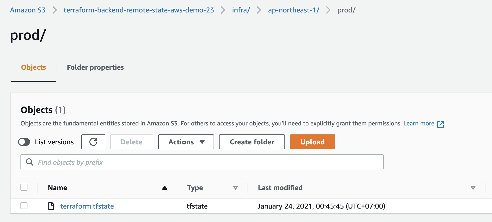
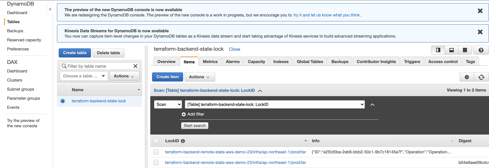

# 9. (上級者編) Terraform Remote Stateを使って、インフラのステートをAWS(S3)に保存しよう

- https://medium.com/faun/3-tier-architecture-with-terraform-and-aws-part-3-setting-up-backend-s3-and-dynamodb-cb4d55d45d98


# 9.1 Terraform Stateの解剖
- https://learn.hashicorp.com/tutorials/terraform/aws-remote?in=terraform/aws-get-started

`terraform apply`の後、`terraform.tfstate`というファイルが作成されます。このファイルに、AWS インフラの状態が保存されています。

例えばChap8でAWS IAM RoleとIAM Policyを作成した場合、下記のステートが保存されています。 
```sh
{
  "version": 4,
  "terraform_version": "0.12.28",
  "serial": 4,
  "lineage": "e36ccc84-1b26-5c2c-2635-fd05c317bcd0",
  "outputs": {},
  "resources": [ # <------- 作成されたAWSリソースのリスト
    {
      "mode": "data",
      "type": "aws_caller_identity",
      "name": "this",
      "provider": "provider.aws",
      "instances": [
        {
          "schema_version": 0,
          "attributes": {
            "account_id": "266981300450",
            "arn": "arn:aws:iam::266981300450:user/aws-demo",
            "id": "2021-01-23 15:43:53.854109 +0000 UTC",
            "user_id": "AIDAT4KKTLDRFBCZHPDQM"
          }
        }
      ]
    },
    {
      "module": "module.iam_assumable_role_custom",
      "mode": "data",
      "type": "aws_iam_policy_document", # <-------IAM Policy document
      "name": "assume_role",
      "provider": "provider.aws",
      "instances": [
        {
          "schema_version": 0,
          "attributes": {
            "id": "3828780280",
            "json": "{\n  \"Version\": \"2012-10-17\",\n  \"Statement\": [\n    {\n      \"Sid\": \"\",\n      \"Effect\": \"Allow\",\n      \"Action\": \"sts:AssumeRole\",\n      \"Principal\": {\n        \"AWS\": \"arn:aws:iam::266981300450:root\",\n        \"Service\": \"ec2.amazonaws.com\"\n      },\n      \"Condition\": {\n        \"StringEquals\": {\n          \"sts:ExternalId\": \"s3-full-access-role\"\n        }\n      }\n    }\n  ]\n}",
            "override_json": null,
            "policy_id": null,
            "source_json": null,
            "statement": [
              {
                "actions": [
                  "sts:AssumeRole"
                ],
                "condition": [
                  {
                    "test": "StringEquals",
                    "values": [
                      "s3-full-access-role"
                    ],
                    "variable": "sts:ExternalId"
                  }
                ],
                "effect": "Allow",
                "not_actions": [],
                "not_principals": [],
                "not_resources": [],
                "principals": [
                  {
                    "identifiers": [
                      "arn:aws:iam::266981300450:root"
                    ],
                    "type": "AWS"
                  },
                  {
                    "identifiers": [
                      "ec2.amazonaws.com"
                    ],
                    "type": "Service"
                  }
                ],
                "resources": [],
                "sid": ""
              }
            ],
            "version": "2012-10-17"
          }
        }
      ]
    },
    {
      "module": "module.iam_assumable_role_custom",
      "mode": "data",
      "type": "aws_iam_policy_document",
      "name": "assume_role_with_mfa",
      "provider": "provider.aws",
      "instances": [
        {
          "schema_version": 0,
          "attributes": {
            "id": "938654391",
            "json": "{\n  \"Version\": \"2012-10-17\",\n  \"Statement\": [\n    {\n      \"Sid\": \"\",\n      \"Effect\": \"Allow\",\n      \"Action\": \"sts:AssumeRole\",\n      \"Principal\": {\n        \"AWS\": \"arn:aws:iam::266981300450:root\",\n        \"Service\": \"ec2.amazonaws.com\"\n      },\n      \"Condition\": {\n        \"Bool\": {\n          \"aws:MultiFactorAuthPresent\": \"true\"\n        },\n        \"NumericLessThan\": {\n          \"aws:MultiFactorAuthAge\": \"86400\"\n        }\n      }\n    }\n  ]\n}",
            "override_json": null,
            "policy_id": null,
            "source_json": null,
            "statement": [
              {
                "actions": [
                  "sts:AssumeRole"
                ],
                "condition": [
                  {
                    "test": "Bool",
                    "values": [
                      "true"
                    ],
                    "variable": "aws:MultiFactorAuthPresent"
                  },
                  {
                    "test": "NumericLessThan",
                    "values": [
                      "86400"
                    ],
                    "variable": "aws:MultiFactorAuthAge"
                  }
                ],
                "effect": "Allow",
                "not_actions": [],
                "not_principals": [],
                "not_resources": [],
                "principals": [
                  {
                    "identifiers": [
                      "arn:aws:iam::266981300450:root"
                    ],
                    "type": "AWS"
                  },
                  {
                    "identifiers": [
                      "ec2.amazonaws.com"
                    ],
                    "type": "Service"
                  }
                ],
                "resources": [],
                "sid": ""
              }
            ],
            "version": "2012-10-17"
          }
        }
      ]
    },
    {
      "module": "module.iam_assumable_role_custom",
      "mode": "managed",
      "type": "aws_iam_instance_profile", # <-------IAM Instance Profile
      "name": "this",
      "each": "list",
      "provider": "provider.aws",
      "instances": []
    },
    {
      "module": "module.s3_full_access_iam_policy",
      "mode": "managed",
      "type": "aws_iam_policy",
      "name": "policy",
      "provider": "provider.aws",
      "instances": [
        {
          "schema_version": 0,
          "attributes": {
            "arn": "arn:aws:iam::266981300450:policy/s3-full-access",
            "description": "s3-full-access",
            "id": "arn:aws:iam::266981300450:policy/s3-full-access",
            "name": "s3-full-access",
            "name_prefix": null,
            "path": "/",
            "policy": "{\n  \"Version\": \"2012-10-17\",\n  \"Statement\": [\n    {\n      \"Action\": [\n        \"s3:*\"\n      ],\n      \"Effect\": \"Allow\",\n      \"Resource\": \"*\"\n    }\n  ]\n}\n"
          },
          "private": "bnVsbA=="
        }
      ]
    },
    {
      "module": "module.iam_assumable_role_custom",
      "mode": "managed",
      "type": "aws_iam_role", # <-------IAM Role
      "name": "this",
      "each": "list",
      "provider": "provider.aws",
      "instances": [
        {
          "index_key": 0,
          "schema_version": 0,
          "attributes": {
            "arn": "arn:aws:iam::266981300450:role/s3-full-access-role",
            "assume_role_policy": "{\"Version\":\"2012-10-17\",\"Statement\":[{\"Sid\":\"\",\"Effect\":\"Allow\",\"Principal\":{\"Service\":\"ec2.amazonaws.com\",\"AWS\":\"arn:aws:iam::266981300450:root\"},\"Action\":\"sts:AssumeRole\",\"Condition\":{\"StringEquals\":{\"sts:ExternalId\":\"s3-full-access-role\"}}}]}",
            "create_date": "2021-01-23T15:44:49Z",
            "description": "",
            "force_detach_policies": false,
            "id": "s3-full-access-role",
            "max_session_duration": 3600,
            "name": "s3-full-access-role",
            "name_prefix": null,
            "path": "/",
            "permissions_boundary": "",
            "tags": null,
            "unique_id": "AROAT4KKTLDRD4Z3CZSTQ"
          },
          "private": "bnVsbA=="
        }
      ]
    },
    {
      "module": "module.iam_assumable_role_custom",
      "mode": "managed",
      "type": "aws_iam_role_policy_attachment",
      "name": "admin",
      "each": "list",
      "provider": "provider.aws",
      "instances": []
    },
    {
      "module": "module.iam_assumable_role_custom",
      "mode": "managed",
      "type": "aws_iam_role_policy_attachment",
      "name": "custom",
      "each": "list",
      "provider": "provider.aws",
      "instances": [
        {
          "index_key": 0,
          "schema_version": 0,
          "attributes": {
            "id": "s3-full-access-role-20210123154454293100000001",
            "policy_arn": "arn:aws:iam::266981300450:policy/s3-full-access",
            "role": "s3-full-access-role"
          },
          "private": "bnVsbA==",
          "dependencies": [
            "module.iam_assumable_role_custom.aws_iam_role.this",
            "module.s3_full_access_iam_policy.aws_iam_policy.policy"
          ]
        }
      ]
    },
    {
      "module": "module.iam_assumable_role_custom",
      "mode": "managed",
      "type": "aws_iam_role_policy_attachment",
      "name": "poweruser",
      "each": "list",
      "provider": "provider.aws",
      "instances": []
    },
    {
      "module": "module.iam_assumable_role_custom",
      "mode": "managed",
      "type": "aws_iam_role_policy_attachment",
      "name": "readonly",
      "each": "list",
      "provider": "provider.aws",
      "instances": []
    }
  ]
}
```

デフォルトでは、__.tfstateファイルはローカル上__ に保存されます。この状態はGitで例えると、__Remote上にコミットしていないローカルChange__ のようなものです。（ローカルコミットですらありません。.tfstateはGitのようにトラッキングされていないので、削除したらリカバーできません。）

ここで問題なのが、複数のデベロパーがTerraformを使うときに、各Localhost上にステートを保存すると、__Single source of truth__ 無くなります。なので、Tfstateファイルをクラウド上に保存し（Gitで、ローカルCommitをRemoteにPushするように）、同じステートを元にTerraformでインフラを構築するのがベストプラクティスになります。

さらに、__複数のデベロパーが同時にTfstateを変更しようとした場合のRace conditionを避ける為__ に、AWSのBackendのImplementationでは __DynamoDB（NoSQL）を使ってLockを取得してから__ 、TerraformをApplyできるように設定できます。


# 9.2 Terraform Remote Backendを設定する為に、S3 bucketとDynamoDBを作成する
- https://www.terraform.io/docs/language/settings/backends/index.html
- https://www.terraform.io/docs/language/settings/backends/s3.html
- https://medium.com/faun/3-tier-architecture-with-terraform-and-aws-part-3-setting-up-backend-s3-and-dynamodb-cb4d55d45d98

[9.2_terraform_backend/backend.tf](9.2_terraform_backend/backend.tf)
```sh
# ref: https://registry.terraform.io/providers/hashicorp/random/latest/docs/resources/integer
resource "random_integer" "digits" {
  min = 1
  max = 100

  keepers = {
    # Generate a new integer each time s3_bucket_name value gets updated
    listener_arn = var.s3_bucket_name
  }
}

variable "s3_bucket_name" {
  default = "terraform-backend-remote-state-aws-demo"
}

# S3 bucket
resource "aws_s3_bucket" "terraform-backend-remote-state" {
  bucket = "${var.s3_bucket_name}-${random_integer.digits.result}" # 注意： S3 bucketの名前はGlobalでユニークでないといけない為、randomな数字を付け足しています

  lifecycle {
    prevent_destroy = true # terraform destroyによって削除されないよう設定
  }

  versioning {
    enabled = true
  }

  server_side_encryption_configuration {
    rule {
      apply_server_side_encryption_by_default {
        sse_algorithm = "AES256"
      }
    }
  }

  tags = {
    Environment = "prod"
    Terraform   = "true"
    Name        = var.s3_bucket_name
  }
}

# DynamoDB for state locking
# ref: https://registry.terraform.io/providers/hashicorp/aws/latest/docs/resources/dynamodb_table
resource "aws_dynamodb_table" "terraform-backend-state-lock" {
  name         = "terraform-backend-state-lock"
  billing_mode = "PAY_PER_REQUEST"
  hash_key     = "LockID" #値はLockIDである必要がある ref: https://www.terraform.io/docs/language/settings/backends/s3.html#dynamodb-state-locking

  attribute {
    name = "LockID" #値はLockIDである必要がある ref: https://www.terraform.io/docs/language/settings/backends/s3.html#dynamodb-state-locking
    type = "S"
  }

  tags = {
    Environment = "prod"
    Terraform   = "true"
  }
}

# Local backendを使って、まずはS3 BucketとDynamoDBを作成する（まだTfstateファイルを保存するS3が存在しない為、Tfstateファイルはローカルに保存）
terraform {
  required_version = ">= 0.12.28"
}
```

```
terraform init
terraform apply
```


# 9.3 Terraform Remote Backendを使ってAWSリソースを作成し、ステートがS3バケットに保存されているか確認する

[9.3_aws_iam/backend.tf](9.3_aws_iam/backend.tf)
```sh
# backend
terraform {
  required_version = ">= 0.12.28"

  # backendはterraform{}ブロック内に定義される
  backend "s3" {
    bucket         = "terraform-backend-remote-state-aws-demo-23"  #このS3 bucketが先に作られている必要がある （つまり、Terraform stateを保存するS3バケットはコンソールで作成するか、Local Terraform backendで作成）
    key            = "infra/ap-northeast-1/prod/terraform.tfstate" # .tfstateをS3 bucket内にObjectとして保存
    region         = "ap-northeast-1"
    dynamodb_table = "terraform-backend-state-lock" # dynamoDBを使ってState Lockを有効化
    encrypt        = true
  }
}
```

```sh
$ terraform apply
Acquiring state lock. This may take a few moments... # <------ state lockを取得しているのがわかる

An execution plan has been generated and is shown below.
Resource actions are indicated with the following symbols:
  + create

Terraform will perform the following actions:


Plan: 3 to add, 0 to change, 0 to destroy.

Do you want to perform these actions?
  Terraform will perform the actions described above.
  Only 'yes' will be accepted to approve.

  Enter a value: yes

aws_iam_policy.s3_full_access: Creating...
aws_iam_role.s3_full_access: Creating...
aws_iam_role.s3_full_access: Creation complete after 4s [id=s3_full_access_role]
aws_iam_policy.s3_full_access: Creation complete after 5s [id=arn:aws:iam::266981300450:policy/s3_full_access]
aws_iam_role_policy.s3_full_access_policy: Creating...
aws_iam_role_policy.s3_full_access_policy: Creation complete after 3s [id=s3_full_access_role:s3_full_access_policy]

Apply complete! Resources: 3 added, 0 changed, 0 destroyed.
Releasing state lock. This may take a few moments... # <------ state lockをリリースしているのがわかる
```


## S3 Bucketをチェック




## DynamoDBのLockIDの値をチェック




`terraform destroy`で削除。


# 9.4 複数のRemote Backend設定がある場合
- https://www.terraform.io/docs/language/settings/backends/configuration.html#partial-configuration

[9.4_multiple_backends/backend.tf](9.4_multiple_backends/backend.tf)
```sh
# # backend
# terraform {
#   required_version = ">= 0.12.28"

#   # backendをHardcodeしないことも可能
#   # backend "s3" {
#   #   bucket         = "terraform-backend-remote-state-aws-demo-23"  #このS3 bucketが先に作られている必要がある （つまり、Terraform stateを保存するS3バケットはコンソールで作成するか、Local Terraform backendで作成）
#   #   key            = "infra/ap-northeast-1/prod/terraform.tfstate" # .tfstateをS3 bucket内にObjectとして保存
#   #   region         = "ap-northeast-1"
#   #   dynamodb_table = "terraform-backend-state-lock" # dynamoDBを使ってState Lockを有効化
#   #   encrypt        = true
#   # }
# }
```

[9.4_multiple_backends/backend.config](9.4_multiple_backends/backend.config)
```sh
bucket         = "terraform-backend-remote-state-aws-demo-23"  #このS3 bucketが先に作られている必要がある （つまり、Terraform stateを保存するS3バケットはコンソールで作成するか、Local Terraform backendで作成）
key            = "infra/ap-northeast-1/prod/terraform.tfstate" # .tfstateをS3 bucket内にObjectとして保存
region         = "ap-northeast-1"
dynamodb_table = "terraform-backend-state-lock" # dynamoDBを使ってState Lockを有効化
encrypt        = true
```

そして、`backend.config`を`terraform init`時にArgumentとしてPassすることで、Hardcodingを避けられると同時に、複数のRemote backendの設定を簡単にInjectできる
```sh
terraform init -backend-config=backend.config

# output
Initializing the backend...

Initializing provider plugins...
- Checking for available provider plugins...
- Downloading plugin for provider "aws" (hashicorp/aws) 2.70.0...


Warning: Missing backend configuration

-backend-config was used without a "backend" block in the configuration.

If you intended to override the default local backend configuration,
no action is required, but you may add an explicit backend block to your
configuration to clear this warning:

terraform {
  backend "local" {}
}

However, if you intended to override a defined backend, please verify that
the backend configuration is present and valid.


Terraform has been successfully initialized!

You may now begin working with Terraform. Try running "terraform plan" to see
any changes that are required for your infrastructure. All Terraform commands
should now work.

If you ever set or change modules or backend configuration for Terraform,
rerun this command to reinitialize your working directory. If you forget, other
commands will detect it and remind you to do so if necessary.
```


`terraform destroy`で削除しましょう。


# 9.5 Cleanup

また9.2に戻って、S3とDynamoDBを`terraform destroy`で削除するのも忘れずにしましょう。