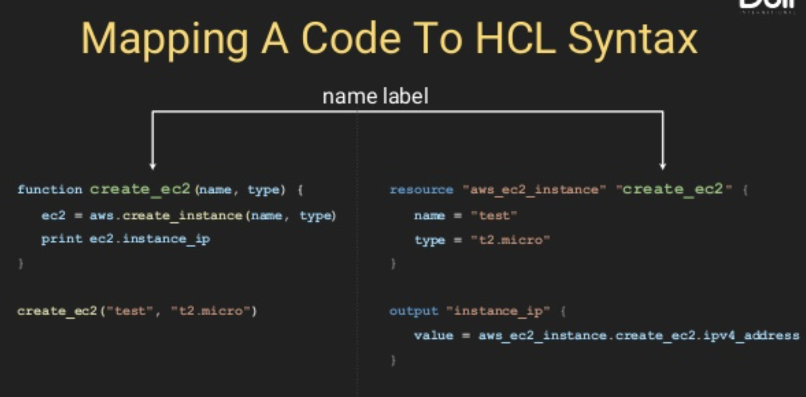

# 米シリコンバレーDevOps監修！超Terraform完全入門コース！

# このコースを取るべき５つの理由

## 1. 大好評！Udemyベストセラーインストラクター（x5）＆現シリコンバレーDevOpsエンジニア（AWS SAAとAWS DevOps Pro、CKA、CKAD保持）による監修


本番現場目線で、Terraform, AWS VPC, EKSを使っている経験をもとに、最新の情報(Terraform v0.14)を紹介します

下記のダイアグラムは、私が本番運用向けにTerraformのみで構築したAWSのアーキテクチャのサンプルです。


## 2. Terraformの超初心者概念から上級レベルSyntaxやコンセプトまでカバー
- Terraformの基本的なリソースタイプ（Resource, Data, Variable, Output、Local）やSyntax

Function/Method name:

[3.1_resource_block/main.tf](3.1_resource_block/main.tf)
```sh
# "aws_instance"というタイプのresourceを定義し、 そのリソースに"web"というローカルネームをつける
resource "aws_instance" "web" {  # <----- function create_ec2(name, type)のTerraformのSyntax

  # aws_instance resourceのArguments
  ami           = "ami-0992fc94ca0f1415a"
  instance_type = "t2.micro"
}
```

- Terraformの関数（Math, List, Map, String, etc）をTerraform consoleでデモ
- さらに上級レベルであるFor loop、__Dynamic Block__、__Nested Map__ もしっかり解説とデモ
```sh
# listの変数をloopする場合
resource "aws_security_group" "vault" {
  name        = "vault"
  description = "Ingress for Vault"
  vpc_id      = aws_vpc.my_vpc.id

  # dynamic "ingress" { 
  #   for_each = var.ingress_ports
  # のSyntaxはJavaでいう下記のSyntaxに相当する
  # Iterator<Map.Entry<String, String>> ingress = var.ingress_ports.entrySet().iterator();
  
  dynamic "ingress" { # <---- localの名前を"ingress"と定義
    # for_each argumentに、LoopするObjectをAssign
    for_each = var.ingress_ports # <------ numberリストの変数をループする

    # The iterator argument (任意)は現在ループしているオブジェクトの名前。デフォルトではdynamic blockの"ingress"になります。
    iterator = port 

    # contentブロック内に、ループしながら作成するブロックのAttributesを定義する
    content { 
      # iteratorオブジェクトであるsettingには２つのAttributeがあり、keyはmap keyかlistのindex.（例：JavaのMap iteratorがkeyとvalueの２つのAttributeを持つのと似ている）
      from_port   = port.value
      to_port     = port.value
      protocol    = "tcp"
      cidr_blocks = ["0.0.0.0/0"]
    }
  }
}
```
- Terraform Registryにある __Remote Module__ を使って、EC2やIAMのコードを再利用
- Terraform __Remote Backend__ で __State locking__（デモではAWS DynamoDBを使用）を有効化し、複数のDevOpsがTerraformのStateファイルを同時に上書きする __Race Condition__ を防ぐ

[9.3_aws_iam/backend.tf](9.3_aws_iam/backend.tf)
```sh
# backend
terraform {
  required_version = ">= 0.12.28"

  # backendはterraform{}ブロック内に定義される
  backend "s3" {
    bucket         = "terraform-backend-remote-state-aws-demo-23"  #このS3 bucketが先に作られている必要がある （つまり、Terraform stateを保存するS3バケットはコンソールで作成するか、Local Terraform backendで作成）
    key            = "infra/ap-northeast-1/prod/terraform.tfstate" # .tfstateをS3 bucket内にObjectとして保存
    region         = "ap-northeast-1"
    dynamodb_table = "terraform-backend-state-lock" # dynamoDBを使ってState Lockを有効化
    encrypt        = true
  }
}
```

## 3. Terraformの難しいポイントを解説
アーキテクチャをデザインする時に大事なポイントや、ややこしい違いなどを、AWS DevOps Pro資格保持のエンジニア視点で解説していきます。

よく間違えやすい点なども言及していくので学習を効率化できます。

[4.4_complex_object/main.tf](4.4_complex_object/main.tf)
```sh
variable "network_config" {
  # オブジェクトとは、それぞれタイプの違うAttributeの集合体。MapやListとの違いは、MapなどはAttributeのタイプが同じでなければいけない点。（例： type = map(string)）
  type = object({
    vpc_name = string # <----　違うタイプが混在
    num_of_subnets = number # <----　違うタイプが混在違うタイプが混在
    create_igw = bool # <----　違うタイプが混在
  })

  default = {
    vpc_name = "test"
    num_of_subnets = 3
    create_igw = true
  }
}
```

## 4. ハンズオン重視の実践型

理論の図解説による理解は元より、実践で構築できることが大事なので、ハンズオンでデモをしています


## 5. 幅広いコースをたったの４時間以内に凝縮
講師である自分が学んでいたときのコースを選ぶ目安は、コースの長さでもありました。すでに仕事で忙しいエンジニアなので、15-20時間以上だとFocusが持たなかったり、冗長で端的にさくっとスパッと学べないことが多いです。そのため、いかに簡潔にコンパクトに学べるかを意識してこのコースを監修しました。

